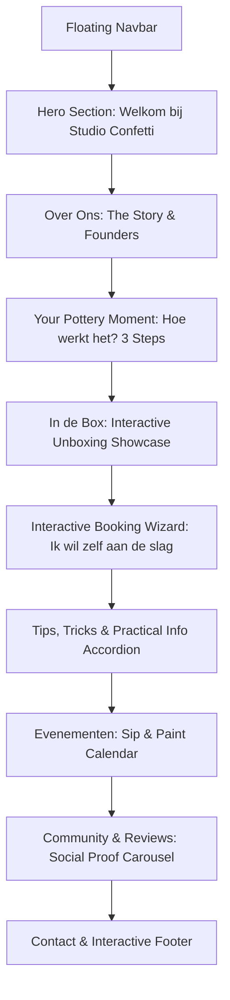

# 🎨 Studio Confetti – Modern One-Page Website Concept & Plan

> **Project:** Modern One-Page Website & Booking Experience for **Studio Confetti** (DIY Clay & Pottery Painting)  
> **Prepared for:** Client Presentation & Development Roadmap  
> **Source Materials:** `Mockup-site.png`, `Homestyle.txt`, `Onboarding visuals/`

---

## 1. Executive Summary & Brand Identity

**Studio Confetti** is a warm, approachable, and creative DIY ceramic painting atelier based in Duffel. Their brand philosophy centers around:
> *"Waar creativiteit en gezelligheid belangrijker zijn dan perfectie!"* (Where creativity and fun matter more than perfection!)

The goal is to elevate the client's initial wireframe into a **modern, vibrant, high-converting, and playful one-page website**. The digital experience should evoke the feeling of opening a fresh pottery box: tactile, inspiring, colorful, and completely stress-free.

---

## 2. Design System: Typography & Color Theory Critique

### 🎨 Color Palette Upgrade

#### Current Client Palette Analysis:
* **Background:** `#F8F3EC` (Warm Ceramic Cream) – *Excellent, warm, cozy, and reduces eye strain.*
* **Primary Coral:** `#F45B4F` – *Vibrant and energetic, but needs careful contrast against light backgrounds.*
* **Cobalt Blue:** `#4166F5` – *Strong, playful, artistic accent.*
* **Confetti Tones:** `#F6D75A` (Sun Yellow), `#F4B6C8` (Pastel Pink), `#C8B6E8` (Soft Lilac).
* **Body Text:** `#555555` – *A bit low in contrast on `#F8F3EC` (fails WCAG AAA contrast guidelines).*

#### 🌟 Recommended Professional Palette (Harmonized & Accessible):

| Role | Color Name | Hex Code | Purpose & Contrast Notes |
| :--- | :--- | :--- | :--- |
| **Canvas / Background** | Warm Bisque Cream | `#FAF6F0` | Soft clay-like foundation, premium tactile feel |
| **Surface / Card Bg** | Pure Porcelain | `#FFFFFF` | Clean contrast for process cards & forms |
| **Primary Brand** | Terracotta Coral | `#E85D4E` | Optimized for WCAG AA readability on light bg |
| **Secondary Accent** | Cobalt Glaze Blue | `#3B5BDB` | CTAs, active highlights, key quotes |
| **Pastel Accent 1** | Glaze Sunshine | `#FCD34D` | Event badges, highlights, playful pills |
| **Pastel Accent 2** | Blossom Pink | `#F9A8D4` | Decorative confetti, process steps |
| **Pastel Accent 3** | Lavender Mist | `#D8B4E8` | Secondary cards, subtle backgrounds |
| **Pastel Accent 4** | Sage Celadon | `#A7D7C5` | Fresh ceramic glaze accent (new balance color) |
| **Text Primary** | Deep Clay Charcoal | `#2B2D42` | High-contrast (11.5:1), effortless readability |
| **Text Secondary** | Soft Graphite | `#5C6170` | Secondary descriptions, timestamps, metadata |

---

### 🔤 Typography Strategy

#### Critique of Initial Setup:
Using 4 distinct font families (*Fredoka*, *Garet*, *Caveat*, *VAG Rounded Next*) can feel disjointed and slows down web performance. 

#### 🌟 Recommended Font Pairing (Balanced, Modern & Playful):

1. **Headings (H1, H2, H3):** **Fredoka** or **Plus Jakarta Sans (ExtraBold Rounded)**
   * *Why:* Keeps the friendly, rounded, bouncy clay-like personality without losing structure.
2. **Handwritten Accents & Micro-quotes:** **Caveat** or **Kalam**
   * *Why:* Adds authentic personal charm for handwritten notes, arrows, and encouraging slogans.
3. **Body & Form Text:** **Plus Jakarta Sans** or **Outfit** (Weights: 400 Regular, 500 Medium, 600 SemiBold)
   * *Why:* Extremely crisp geometric sans-serif with subtle rounded aesthetics. Ensures high legibility on mobile screens for booking forms and step-by-step guides.

```
Typography Hierarchy:
├── H1 Hero: Fredoka (Bold / 48px - 64px)
├── H2 Section Headers: Fredoka (SemiBold / 32px - 40px)
├── Slogans / Callouts: Caveat (Bold / 24px - 30px)
└── Body & UI: Plus Jakarta Sans (Regular & Medium / 16px - 18px)
```

---

## 3. One-Page Architecture & Section Breakdown



---

### Section 1: Sticky Navigation Bar
* **Branding:** Studio Confetti SVG logo with animated clay dot.
* **Anchor Links:** `Over ons` · `Hoe het werkt` · `Boek een box` · `Events` · `Reviews` · `Contact`
* **CTA Button:** *"Reserveer jouw Box"* (Contrasting Cobalt pill button with hover bounce).

---

### Section 2: Hero Section (SEO & Conversion-Focused)
* **SEO-Optimized H1 Headline:** *"Welkom bij Studio Confetti"* (Terracotta Coral)  
  * *SEO Subtitle (H2 / Subheading):* *"DIY Keramiek & Pottery Box Huren in Duffel"*
* **Handwritten Slogan:** *"Waar creativiteit en gezelligheid belangrijker zijn dan perfectie!"* (Caveat font with animated SVG squiggle underline).
* **High-Converting Primary & Secondary CTAs:**
  * 🔴 **Primary CTA Button:** `[📦 Huur Jouw Pottery Box]`
    * Bold, elevated button in Cobalt Blue / Terracotta Coral with magnetic hover effect.
    * Directly smooth-scrolls to **Section 6 (Interactive Booking Wizard)**.
  * ⚪ **Secondary Ghost CTA:** `[👀 Bekijk Hoe Het Werkt]`
    * Outlined pill button linking to **Section 4 (Stap-voor-stap proces)**.
* **Above-The-Fold Trust Indicators (Micro-badges):**
  * ⭐ **5/5 Tevreden Makers**
  * 📦 **Alles-in-één Doe-Het-Zelf Pakket**
  * 📍 **Eenvoudig Ophalen in Duffel**
  * 🔥 **Inclusief Glazuren & Professioneel Afbakken**
* **Visual Anchor:** Clean, mouth-watering hero imagery / organic floating cut-outs of finished glazed pieces (e.g. striped mugs, spoon rests, decorated coasters) with soft floating confetti particles in the background.

> **💡 SEO & UX Rationale:**  
> Replacing the 5 separate navigation blobs with a single, clear **Hero CTA** avoids "choice overload" (Hick's Law), dramatically boosts Above-The-Fold conversion rates, and signals search engines (Google) the primary commercial search intent: *DIY pottery box rental in Duffel / Antwerp*.

---

### Section 3: Over Ons (The Founders & Story)
* **Narrative:** Story of two friends who turned their pottery passion into a shared experience.
* **Layout:** Two-column split layout.
  * **Left:** Narrative text with value highlight badges:
    * ☕ *Geen ervaring nodig*
    * ✨ *100% Ontspannen*
    * 📦 *Alles in 1 complete doos*
  * **Right:** Framed photo of the founders (from `Onboarding visuals/3.png`) with organic wobbly ceramic frame border and floating confetti particles.

---

### Section 4: Your Pottery Moment – Hoe gaat het in zijn werk?
A clean, visual **3-Step Journey** presented as rounded, elevated clay cards:

1. **Stap 1: Aanvraag & Keuze**
   * *Icon:* Sparkle / Calendar
   * *Text:* Kies je datum via onze planner, selecteer je favoriete biscuits (mokken, schaaltjes, tegels) en verzend je aanvraag.
2. **Stap 2: Mini-Atelier @ Home**
   * *Icon:* Pottery Box / Paintbrush
   * *Text:* Haal je box op in Duffel en transformeer je huiskamer in een ontspannen keramiekstudio.
3. **Stap 3: Professionele Afwerking**
   * *Icon:* Kiln / Shiny Glaze
   * *Text:* Breng de box terug; wij glazuren en bakken jouw kunstwerkjes professioneel af op 1000°C.

---

### Section 5: "Wat zit er in de box?" (Interactive Drawer / Showcase)
*Visual breakdown based on `Wat zit er in de box.png`:*
* **Interactive Hotspot Card / Grid:**
  * 🖌️ Penselen in diverse maten en vormen
  * 🎨 Mayco Stroke & Coat glazuren (food-safe, glanzend resultaat)
  * 🏺 Biscuit keramiek naar keuze
  * 🏷️ Mini-voorbeeld tegeltjes met echte kleurresultaten (3 lagen)
  * 🥣 Mengpaletjes & lila uitspoelbekers
  * 🛡️ Beschermfolie voor tafel + schetspotloden & sponzen

---

### Section 6: Interactive DIY Booking Wizard ("Ik wil zelf aan de slag!")
A seamless, gamified multi-step booking configurator that guides customers step-by-step:

* **Step 1: Gezelschap & Contact**
  * Naam, E-mail, Telefoonnummer, Aantal personen.
* **Step 2: Datumprikker (Live Calendar)**
  * Intuitive calendar picker indicating pickup/return dates and available slots in Duffel.
* **Step 3: De Biscuit Bar (Interactive Ceramic Selector)**
  * Visual cards with photo, dimensions, and quantity stepper `[-] 1 [+]`:
    * ☕ Gestreept Mokje
    * 🍳 Lepelhouder / Spoon rest
    * 🍞 Tapasbordje & Onderzetters
    * 🥚 Eierdopjes & Mini-vaasjes
  * **Live Box Counter:** "Jouw box bevat: *4 stuks keramiek*".
* **Step 4: Overzicht & Bevestigen**
  * Clear visual summary of chosen items, rental dates, security deposit info (€100 waarborg), and one-click submission.
  * 🎉 **Celebration confetti trigger** upon submission!

---

### Section 7: Tips & Praktische Afspraken (Accordion / Tabs)
*Clean accordion drawer for key questions (sourced from onboarding materials):*
* ❓ **Hoeveel lagen glazuur breng ik aan?** (Advies voor 3 dekkende lagen).
* ❓ **Wat als ik een foutje maak?** (Sponsje + water reset).
* ❓ **Hoe werkt de waarborg?** (€100 borgsom, retour binnen afgesproken termijn).
* ❓ **Kan ik eigen verf gebruiken?** (Enkel meegeleverde Mayco glazuren voor ovencompatibiliteit).

---

### Section 8: Evenementen (Sip & Paint Nights)
* Modern pill-shaped event cards matching the mockup:
  * 🟡 **Sip & Paint – 20/09/2026 – Duffel** → `[VOLZET]` (Disabled state with subtle grayed badge)
  * 🌸 **Sip & Paint – 20/10/2026 – Duffel** → `[SCHRIJF NU IN]` (Vibrant animated hover CTA)
  * 🟣 **Keramiek & Brunch – Datum volgt** → `[HOUD ME OP DE HOOGTE]`

---

### Section 9: Reviews & Social Community Wall
* **Reviews Carousel:** Cards featuring quotes, 5-star badges, and photos of customer creations.
* **Illustration:** The pottery artist character illustration from `Mockup-site.png`.
* **Instagram Feed Grid / Tag:** *"Tag @studioconfetti.be en toon je creatie!"*

---

### Section 10: Contact & Footer
* **Quick Contact Cards:**
  * ✉️ **E-mail:** Direct mailto button
  * 💬 **WhatsApp / Telefoon:** Quick WhatsApp chat link
  * 📍 **Atelier Locatie:** Duffel, België (met ophaalinstructies)
* **Playful Shapes:** Organic pastel ceramic geometric blocks that subtly float or rotate on hover.

---

## 4. Animation & Micro-Interaction Concepts

To make the website feel **alive, tactile, and modern**, the following animations are planned:

| Area | Animation Concept | Technical Execution |
| :--- | :--- | :--- |
| **Confetti Physics** | Subtle floating confetti chips in background that gently react to mouse cursor / gyroscope on mobile. | Lightweight Canvas / Canvas-Confetti or CSS `@keyframes float` |
| **Magnetic Hero CTA & Accents** | The primary "Huur jouw Pottery Box" CTA button and decorative ceramic badges gently follow the cursor on hover. | Framer Motion `spring` or GSAP QuickTo |
| **Ceramic Glaze Reveal** | Before/After slider or hover effect showing raw matte biscuit turning into glossy colorful glazed ceramic. | CSS mask-image clip-path transition |
| **Scroll-Triggered Reveals** | Cards, text blocks, and step numbers slide up with a soft bounce stagger as you scroll down. | IntersectionObserver + Tailwind `animate-in` or Framer Motion |
| **Booking Step Transitions** | Smooth horizontal slide transitions between Wizard steps with progress bar filling up. | Framer Motion AnimatePresence |
| **Success Celebration** | On booking submission, a customized pastel confetti explosion shoots across the screen. | `canvas-confetti` with custom colors (`#F6D75A`, `#F45B4F`, `#4166F5`, `#F4B6C8`, `#C8B6E8`) |
| **Handwritten Underlines** | SVG squiggles and handwritten text in Caveat "draw themselves" when entering the viewport. | SVG `stroke-dasharray` / `stroke-dashoffset` animation |

---

## 5. Technical Requirements & Architecture

### Recommended Tech Stack:
* **Framework:** **Next.js (React)** or **Vite + React / Astro** (Fast loading, SEO optimized, perfect for interactive single-page sites).
* **Styling:** **Tailwind CSS v4** with a custom theme extension for the Studio Confetti design tokens.
* **Animations:** **Framer Motion** (Fluid, spring-based UI physics) + **Lucide React Icons** (Clean, lightweight icons).
* **Form & Booking Handler:** 
  * Simple & robust: **Formspree** or **Resend API** (sends instant email confirmations with formatted booking summaries to the client and customer).
  * Date Picker: **React Day Picker** / **Radix UI Popover**.

---

## 6. Required Assets & Client Checklist ("Things You'll Need")

To finalize the mockup and build the live site, gather the following assets from the client:

- [ ] **Biscuits Catalog Photos:** High-resolution isolated photos of the unpainted biscuits (mugs, plates, coasters, vases, bowls) with their respective rental/purchase prices.
- [ ] **High-Res Photos:** Originals of the founders (`3.png`), painted pottery pieces (`10.png`, `11.png`), and the workshop atmosphere.
- [ ] **Vector Logo:** SVG or transparent PNG of the Studio Confetti logo and confetti graphics.
- [ ] **Specific Event Dates:** Confirmed dates, locations, ticket prices, and maximum seats for upcoming Sip & Paint workshops.
- [ ] **Contact Details & Pickup Address:** Exact pickup address/times in Duffel, WhatsApp business phone number, and official contact email address.
- [ ] **Bank / Payment Terms:** Clarification on how the €100 security deposit is collected (e.g. Payconiq QR code, bank transfer, or online checkout).

---

## 7. Next Steps & Implementation Roadmap

1. **Client Review:** Present this design plan, refined color palette, and animation ideas to the client.
2. **Interactive UI Prototype:** Build the interactive React/Tailwind one-page site with live animations and the working booking wizard.
3. **Asset Integration:** Replace placeholder shapes with high-res photos from `Onboarding visuals/`.
4. **Testing & Mobile Optimization:** Ensure full touch responsiveness, fast load speeds, and fluid 60fps animations on smartphones and tablets.
5. **Launch & Handover:** Connect domain, set up email notifications for bookings, and launch!
